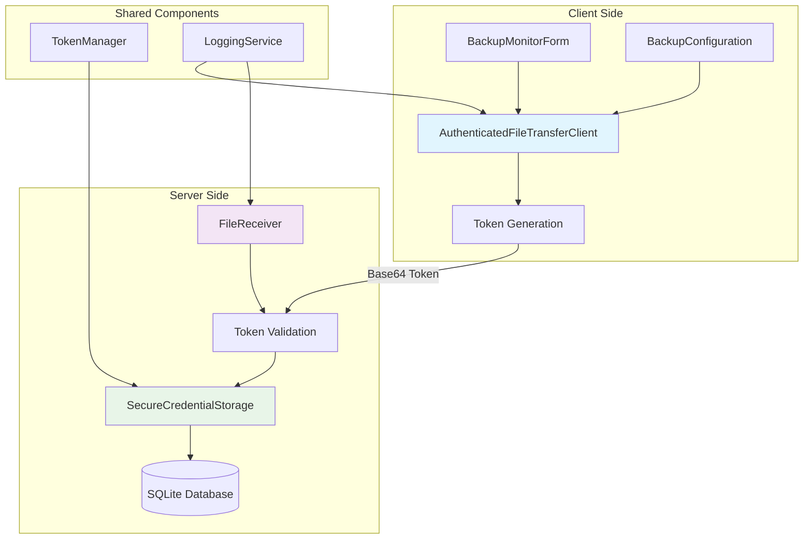

# Design Document: Authentication Token Fix

## Overview

This design addresses the authentication token failure issue in the MySQL Backup Tool by implementing a robust credential management and authentication flow between the client and server components. The solution ensures proper initialization of default credentials, correct token generation and validation, and comprehensive error handling throughout the authentication process.

The fix involves modifications to the credential storage system, authentication flow in both client and server components, and integration with the backup configuration system to ensure seamless operation.

## Architecture

The authentication system follows a client-server model with the following key components:



The authentication flow operates as follows:
1. Client retrieves credentials from BackupConfiguration
2. AuthenticatedFileTransferClient creates base64-encoded token
3. Token is sent to server with file transfer request
4. FileReceiver validates token against stored credentials
5. On success, file transfer proceeds; on failure, descriptive error is returned

## Components and Interfaces

### Enhanced SecureCredentialStorage

The SecureCredentialStorage service will be enhanced to provide comprehensive credential management:

```csharp
public interface ISecureCredentialStorage
{
    Task<bool> EnsureDefaultCredentialsExistAsync();
    Task<ClientCredentials> GetDefaultCredentialsAsync();
    Task<ClientCredentials> GetCredentialsByClientIdAsync(string clientId);
    Task<bool> ValidateCredentialsAsync(string clientId, string clientSecret);
    Task StoreCredentialsAsync(ClientCredentials credentials);
    Task<bool> CredentialsExistAsync(string clientId);
}

public class ClientCredentials
{
    public string ClientId { get; set; }
    public string ClientSecret { get; set; }
    public DateTime CreatedAt { get; set; }
    public DateTime? LastUsed { get; set; }
}
```

### Enhanced BackupConfiguration

The BackupConfiguration model will include authentication properties:

```csharp
public class BackupConfiguration
{
    // Existing properties...
    
    public string ClientId { get; set; } = "default-client";
    public string ClientSecret { get; set; } = "default-secret-2024";
    
    public bool HasValidCredentials()
    {
        return !string.IsNullOrWhiteSpace(ClientId) && 
               !string.IsNullOrWhiteSpace(ClientSecret);
    }
}
```

### Enhanced AuthenticatedFileTransferClient

The client will implement proper credential retrieval and token generation:

```csharp
public class AuthenticatedFileTransferClient : IFileTransferClient
{
    private readonly ISecureCredentialStorage _credentialStorage;
    private readonly ILogger<AuthenticatedFileTransferClient> _logger;
    
    public async Task<string> CreateAuthenticationTokenAsync(BackupConfiguration config)
    {
        // Validate configuration has credentials
        if (!config.HasValidCredentials())
        {
            // Fallback to default credentials
            var defaultCreds = await _credentialStorage.GetDefaultCredentialsAsync();
            config.ClientId = defaultCreds.ClientId;
            config.ClientSecret = defaultCreds.ClientSecret;
        }
        
        // Create base64-encoded token
        var credentials = $"{config.ClientId}:{config.ClientSecret}";
        var token = Convert.ToBase64String(Encoding.UTF8.GetBytes(credentials));
        
        _logger.LogDebug("Created authentication token for client {ClientId}", config.ClientId);
        return token;
    }
}
```

### Enhanced FileReceiver

The server will implement robust token validation:

```csharp
public class FileReceiver : IFileReceiver
{
    private readonly ISecureCredentialStorage _credentialStorage;
    private readonly ILogger<FileReceiver> _logger;
    
    public async Task<AuthenticationResult> ValidateTokenAsync(string token)
    {
        try
        {
            // Decode base64 token
            var decodedBytes = Convert.FromBase64String(token);
            var credentials = Encoding.UTF8.GetString(decodedBytes);
            
            // Parse clientId:clientSecret format
            var parts = credentials.Split(':', 2);
            if (parts.Length != 2)
            {
                return AuthenticationResult.Failure("Invalid token format");
            }
            
            var clientId = parts[0];
            var clientSecret = parts[1];
            
            // Validate against stored credentials
            var isValid = await _credentialStorage.ValidateCredentialsAsync(clientId, clientSecret);
            
            if (isValid)
            {
                _logger.LogInformation("Authentication successful for client {ClientId}", clientId);
                return AuthenticationResult.Success(clientId);
            }
            else
            {
                _logger.LogWarning("Authentication failed for client {ClientId}", clientId);
                return AuthenticationResult.Failure("Invalid credentials");
            }
        }
        catch (Exception ex)
        {
            _logger.LogError(ex, "Error validating authentication token");
            return AuthenticationResult.Failure("Token validation error");
        }
    }
}

public class AuthenticationResult
{
    public bool IsSuccess { get; private set; }
    public string ClientId { get; private set; }
    public string ErrorMessage { get; private set; }
    
    public static AuthenticationResult Success(string clientId) => 
        new() { IsSuccess = true, ClientId = clientId };
    
    public static AuthenticationResult Failure(string error) => 
        new() { IsSuccess = false, ErrorMessage = error };
}
```

## Data Models

### Database Schema Updates

The existing credential storage will be enhanced to support the authentication flow:

```sql
-- Existing table structure (no changes needed)
CREATE TABLE IF NOT EXISTS ClientCredentials (
    Id INTEGER PRIMARY KEY AUTOINCREMENT,
    ClientId TEXT NOT NULL UNIQUE,
    ClientSecret TEXT NOT NULL,
    CreatedAt DATETIME NOT NULL,
    LastUsed DATETIME,
    IsActive BOOLEAN NOT NULL DEFAULT 1
);

-- Default credentials will be inserted during initialization
INSERT OR IGNORE INTO ClientCredentials (ClientId, ClientSecret, CreatedAt, IsActive)
VALUES ('default-client', 'default-secret-2024', datetime('now'), 1);
```

### Configuration Model Updates

The BackupConfiguration entity will be updated to include authentication fields:

```csharp
[Table("BackupConfigurations")]
public class BackupConfiguration
{
    [Key]
    public int Id { get; set; }
    
    // Existing properties...
    public string DatabaseName { get; set; }
    public string ConnectionString { get; set; }
    public string BackupPath { get; set; }
    
    // New authentication properties
    [Required]
    [MaxLength(100)]
    public string ClientId { get; set; } = "default-client";
    
    [Required]
    [MaxLength(200)]
    public string ClientSecret { get; set; } = "default-secret-2024";
    
    public DateTime CreatedAt { get; set; }
    public DateTime UpdatedAt { get; set; }
}
```

## Correctness Properties

*A property is a characteristic or behavior that should hold true across all valid executions of a system-essentially, a formal statement about what the system should do. Properties serve as the bridge between human-readable specifications and machine-verifiable correctness guarantees.*

Before writing the correctness properties, let me analyze the acceptance criteria to determine which ones are testable:

<function_calls>
<invoke name="prework">
<parameter name="featureName">authentication-token-fix

Based on the prework analysis, here are the consolidated correctness properties:

**Property 1: System initialization ensures default credentials**
*For any* system initialization, default client credentials with ClientId="default-client" and ClientSecret="default-secret-2024" should exist in the database after initialization, and subsequent initializations should not overwrite existing credentials.
**Validates: Requirements 1.1, 3.1, 3.2**

**Property 2: Token format consistency**
*For any* valid client credentials, the authentication token should be base64-encoded in the format "clientId:clientSecret", and decoding should always yield the original credential format.
**Validates: Requirements 1.4, 2.2, 5.2**

**Property 3: Credential validation round-trip**
*For any* stored client credentials, validating them against the SecureCredentialStorage should return true, and invalid credentials should return false.
**Validates: Requirements 2.3, 5.3**

**Property 4: Authentication flow completeness**
*For any* backup operation with valid credentials, the client should successfully retrieve credentials, create a valid token, and the server should validate it and allow the operation to proceed.
**Validates: Requirements 5.1, 5.4**

**Property 5: Configuration persistence consistency**
*For any* backup configuration with updated credentials, saving and then loading the configuration should yield the same credential values.
**Validates: Requirements 1.5, 6.5**

**Property 6: Default credential fallback behavior**
*For any* backup configuration missing credentials, the system should automatically use default credentials and the configuration should function correctly.
**Validates: Requirements 3.4, 6.3**

**Property 7: Authentication error handling**
*For any* authentication failure scenario (missing, invalid, or malformed credentials), the system should log appropriate error messages without exposing sensitive information and provide user-friendly error messages.
**Validates: Requirements 4.1, 4.2, 4.3, 4.4**

**Property 8: Audit logging completeness**
*For any* authentication attempt (successful or failed), the system should log the attempt with timestamp, client identifier, and outcome for audit purposes.
**Validates: Requirements 4.5, 5.5**

**Property 9: Configuration model completeness**
*For any* BackupConfiguration instance, it should have ClientId and ClientSecret properties and provide validation methods for credential completeness.
**Validates: Requirements 6.1, 6.2, 6.4**

**Property 10: Credential storage interface completeness**
*For any* SecureCredentialStorage implementation, it should provide all required methods (retrieve, create, validate, ensure defaults) and they should function correctly.
**Validates: Requirements 3.3**

## Error Handling

The authentication system implements comprehensive error handling at multiple levels:

### Client-Side Error Handling

1. **Missing Credentials**: When backup configuration lacks credentials, the client automatically falls back to default credentials
2. **Token Creation Failures**: If token generation fails, the client logs the error and displays a user-friendly message
3. **Network Errors**: Connection failures during authentication are caught and reported with retry suggestions
4. **Configuration Validation**: Invalid configurations are detected early with specific error messages

### Server-Side Error Handling

1. **Token Decoding Errors**: Malformed base64 tokens are caught and logged with appropriate error responses
2. **Format Validation**: Tokens not matching "clientId:clientSecret" format are rejected with descriptive errors
3. **Credential Validation**: Invalid credentials are logged securely without exposing sensitive information
4. **Database Errors**: Credential storage failures are handled gracefully with fallback mechanisms

### Error Response Format

```csharp
public class AuthenticationError
{
    public string ErrorCode { get; set; }
    public string Message { get; set; }
    public string Details { get; set; }
    public DateTime Timestamp { get; set; }
    
    public static AuthenticationError MissingCredentials() => new()
    {
        ErrorCode = "AUTH_001",
        Message = "Client credentials are missing or invalid",
        Details = "Please check your backup configuration settings",
        Timestamp = DateTime.UtcNow
    };
    
    public static AuthenticationError InvalidToken() => new()
    {
        ErrorCode = "AUTH_002", 
        Message = "Authentication token is malformed",
        Details = "Token must be base64-encoded clientId:clientSecret",
        Timestamp = DateTime.UtcNow
    };
    
    public static AuthenticationError InvalidCredentials() => new()
    {
        ErrorCode = "AUTH_003",
        Message = "Authentication failed",
        Details = "The provided credentials are not valid",
        Timestamp = DateTime.UtcNow
    };
}
```

## Testing Strategy

The authentication fix will be validated using a dual testing approach combining unit tests and property-based tests to ensure comprehensive coverage.

### Unit Testing Approach

Unit tests will focus on specific scenarios and edge cases:

- **Specific Examples**: Test authentication with known good and bad credentials
- **Edge Cases**: Empty strings, null values, malformed tokens
- **Integration Points**: Database initialization, configuration loading, UI error display
- **Error Conditions**: Network failures, database errors, invalid formats

### Property-Based Testing Approach

Property-based tests will verify universal properties across all inputs using FsCheck:

- **Minimum 100 iterations** per property test to ensure comprehensive input coverage
- Each property test references its corresponding design document property
- **Tag format**: `Feature: authentication-token-fix, Property {number}: {property_text}`

**Key Property Test Categories**:

1. **Initialization Properties**: System always creates default credentials correctly
2. **Token Format Properties**: All tokens follow the correct base64 encoding format
3. **Validation Properties**: Credential validation is consistent and secure
4. **Persistence Properties**: Configuration changes are always saved and retrievable
5. **Error Handling Properties**: All error scenarios produce appropriate responses
6. **Audit Properties**: All authentication attempts are properly logged

**Property Test Configuration**:
- Use FsCheck generators for creating random credentials, configurations, and tokens
- Configure custom generators for valid/invalid credential formats
- Set up database fixtures for testing persistence properties
- Mock external dependencies for isolated testing

**Example Property Test Structure**:
```csharp
[Property]
public Property TokenFormatConsistency()
{
    return Prop.ForAll<string, string>((clientId, clientSecret) =>
    {
        // Arrange: Create credentials
        var config = new BackupConfiguration 
        { 
            ClientId = clientId, 
            ClientSecret = clientSecret 
        };
        
        // Act: Create and decode token
        var token = authClient.CreateAuthenticationToken(config);
        var decoded = DecodeToken(token);
        
        // Assert: Format matches expected pattern
        return decoded == $"{clientId}:{clientSecret}";
    }).Label("Feature: authentication-token-fix, Property 2: Token format consistency");
}
```

### Test Coverage Requirements

- **Unit Test Coverage**: Minimum 90% code coverage for authentication-related classes
- **Property Test Coverage**: All 10 correctness properties must have corresponding property tests
- **Integration Test Coverage**: End-to-end authentication flow from client to server
- **Error Path Coverage**: All error handling paths must be tested

The testing strategy ensures that both specific known scenarios and general universal properties are validated, providing confidence in the authentication system's correctness and robustness.