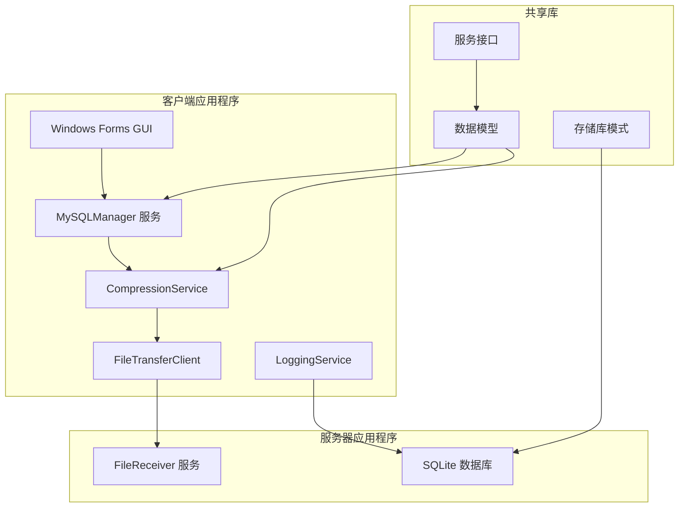
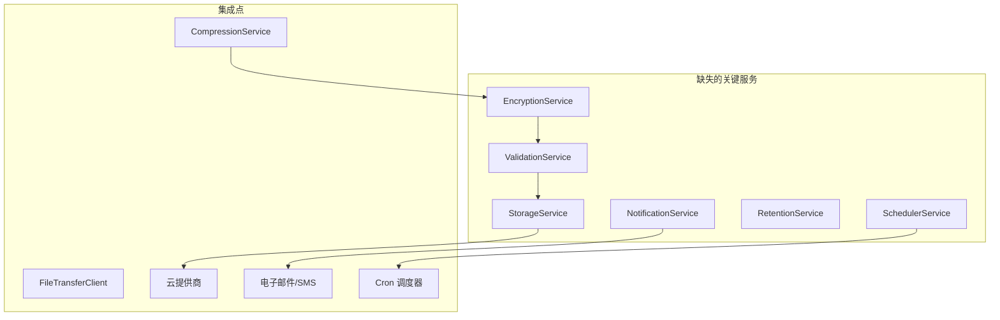

# 设计文档：MySQL 备份工具 - 更新架构

## 概述

MySQL 全文件备份工具是基于 .NET 构建的分布式备份解决方案，为 MySQL 数据库提供企业级备份功能。系统采用客户端-服务器架构，其中备份客户端管理 MySQL 实例并创建备份，而文件接收服务器处理存储和文件管理。

**当前实现状态**: 系统具有大量工作功能，但需要接口对齐和实现缺失的关键服务以实现完整规格合规性。

## 当前架构分析

### 已实现的组件

系统当前具有以下工作组件：



### 缺失的组件（待实现）



## 服务架构

### 当前服务实现

#### 1. MySQLManager 服务
**位置**: `src/MySqlBackupTool.Shared/Services/MySQLManager.cs`
**状态**: ✅ 已实现
**功能**:
- MySQL 服务生命周期管理
- 数据库备份执行
- 连接验证
- 进度报告
- 错误处理和恢复

**需要的接口**: `IBackupService` (用于测试兼容性)

#### 2. CompressionService
**位置**: `src/MySqlBackupTool.Shared/Services/CompressionService.cs`
**状态**: ✅ 已实现
**功能**:
- GZip 压缩
- 异步文件处理
- 进度报告
- 内存高效流处理

**需要的接口**: `ICompressionService` (已存在)

#### 3. FileTransferClient
**位置**: `src/MySqlBackupTool.Shared/Services/FileTransferClient.cs`
**状态**: ✅ 已实现
**功能**:
- 基于 TCP 的文件传输
- 进度跟踪
- 连接管理
- 错误处理和重试

**需要的接口**: `IFileTransferService` (用于一致性)

#### 4. LoggingService
**位置**: `src/MySqlBackupTool.Shared/Services/LoggingService.cs`
**状态**: ✅ 已实现
**功能**:
- 使用 Serilog 的结构化日志
- 多个输出目标
- 可配置的日志级别
- 性能监控

**需要的接口**: `ILoggingService` (用于依赖注入)

### 缺失服务规格

#### 1. EncryptionService (关键)
**接口**: `IEncryptionService`
**要求**:
```csharp
public interface IEncryptionService
{
    Task EncryptAsync(string inputPath, string outputPath, string password, CancellationToken cancellationToken = default);
    Task DecryptAsync(string inputPath, string outputPath, string password, CancellationToken cancellationToken = default);
    bool ValidatePassword(string encryptedFilePath, string password);
    Task<EncryptionMetadata> GetMetadataAsync(string encryptedFilePath);
}
```

**实现要求**:
- AES-256 加密
- PBKDF2 密钥派生
- 大文件流处理
- 进度报告
- 安全内存处理

#### 2. ValidationService (关键)
**接口**: `IValidationService`
**要求**:
```csharp
public interface IValidationService
{
    Task<ValidationResult> ValidateBackupAsync(string filePath, CancellationToken cancellationToken = default);
    Task<bool> ValidateIntegrityAsync(string filePath, string expectedChecksum);
    Task<string> CalculateChecksumAsync(string filePath, ChecksumAlgorithm algorithm = ChecksumAlgorithm.SHA256);
    Task<ValidationReport> GenerateReportAsync(string filePath);
}
```

**实现要求**:
- 文件完整性验证
- 校验和计算（MD5、SHA256）
- 损坏检测
- 详细报告
- 性能优化

#### 3. StorageService (中等优先级)
**接口**: `IStorageService`
**要求**:
```csharp
public interface IStorageService
{
    Task<UploadResult> UploadAsync(string filePath, StorageProvider provider, StorageConfig config, CancellationToken cancellationToken = default);
    Task<DownloadResult> DownloadAsync(string remoteKey, string localPath, StorageProvider provider, StorageConfig config);
    Task<bool> ExistsAsync(string remoteKey, StorageProvider provider, StorageConfig config);
    Task<StorageInfo> GetInfoAsync(string remoteKey, StorageProvider provider, StorageConfig config);
}
```

**支持的提供商**:
- AWS S3
- Azure Blob Storage
- Google Cloud Storage
- 本地文件系统

#### 4. NotificationService (中等优先级)
**接口**: `INotificationService`
**要求**:
```csharp
public interface INotificationService
{
    Task SendAsync(NotificationMessage message, NotificationChannel channel, CancellationToken cancellationToken = default);
    Task SendBulkAsync(IEnumerable<NotificationMessage> messages, NotificationChannel channel);
    Task<NotificationStatus> GetStatusAsync(string notificationId);
    Task<IEnumerable<NotificationTemplate>> GetTemplatesAsync();
}
```

**支持的渠道**:
- 电子邮件 (SMTP)
- Webhooks
- SMS (可选)
- Slack 集成 (可选)

#### 5. RetentionService (中等优先级)
**接口**: `IRetentionService`
**要求**:
```csharp
public interface IRetentionService
{
    Task ApplyPolicyAsync(RetentionPolicy policy, string backupDirectory, CancellationToken cancellationToken = default);
    Task<RetentionReport> AnalyzeAsync(string backupDirectory, RetentionPolicy policy);
    Task<IEnumerable<string>> GetExpiredFilesAsync(string backupDirectory, RetentionPolicy policy);
    Task CleanupAsync(IEnumerable<string> filesToDelete, bool dryRun = false);
}
```

**策略类型**:
- 基于年龄的保留
- 基于数量的保留
- 基于大小的保留
- 自定义保留规则

#### 6. SchedulerService (低优先级)
**接口**: `ISchedulerService`
**要求**:
```csharp
public interface ISchedulerService
{
    Task ScheduleAsync(BackupSchedule schedule, CancellationToken cancellationToken = default);
    Task UnscheduleAsync(string scheduleId);
    Task<IEnumerable<BackupSchedule>> GetSchedulesAsync();
    Task<ScheduleStatus> GetStatusAsync(string scheduleId);
    Task ExecuteNowAsync(string scheduleId);
}
```

**功能**:
- Cron 表达式支持
- 循环计划
- 一次性计划
- 计划监控
- 执行历史

## 数据模型

### 当前模型（已实现）
位于 `src/MySqlBackupTool.Shared/Models/`:
- `BackupConfiguration.cs`
- `MySQLConnectionInfo.cs`
- `ServerEndpoint.cs`
- `FileNamingStrategy.cs`
- `BackupOperationModels.cs`
- `TransferModels.cs`
- `LoggingModels.cs`

### 缺失模型（待实现）

#### 加密模型
```csharp
public class EncryptionMetadata
{
    public string Algorithm { get; set; } = "AES-256";
    public string KeyDerivation { get; set; } = "PBKDF2";
    public int Iterations { get; set; } = 100000;
    public byte[] Salt { get; set; }
    public byte[] IV { get; set; }
    public DateTime EncryptedAt { get; set; }
    public long OriginalSize { get; set; }
    public string OriginalChecksum { get; set; }
}

public class EncryptionConfig
{
    public string Password { get; set; }
    public int KeySize { get; set; } = 256;
    public int Iterations { get; set; } = 100000;
    public bool SecureDelete { get; set; } = true;
}
```

#### 验证模型
```csharp
public class ValidationResult
{
    public bool IsValid { get; set; }
    public string FilePath { get; set; }
    public long FileSize { get; set; }
    public string Checksum { get; set; }
    public ChecksumAlgorithm Algorithm { get; set; }
    public DateTime ValidatedAt { get; set; }
    public List<ValidationIssue> Issues { get; set; } = new();
    public TimeSpan ValidationDuration { get; set; }
}

public class ValidationIssue
{
    public ValidationIssueType Type { get; set; }
    public string Description { get; set; }
    public ValidationSeverity Severity { get; set; }
}
```

#### 存储模型
```csharp
public class StorageConfig
{
    public StorageProvider Provider { get; set; }
    public string ConnectionString { get; set; }
    public string BucketName { get; set; }
    public string Region { get; set; }
    public Dictionary<string, string> AdditionalSettings { get; set; } = new();
}

public class UploadResult
{
    public bool Success { get; set; }
    public string RemoteKey { get; set; }
    public long BytesUploaded { get; set; }
    public TimeSpan Duration { get; set; }
    public string ErrorMessage { get; set; }
}
```

## 集成工作流

### 当前工作流（已实现）
1. **配置** → 从 SQLite 数据库加载备份设置
2. **MySQL 管理** → 安全停止 MySQL 服务
3. **压缩** → 将数据目录压缩为 ZIP 文件
4. **传输** → 通过 TCP 将压缩文件发送到服务器
5. **日志记录** → 记录操作详情和进度
6. **清理** → 删除临时文件并重启 MySQL

### 目标工作流（包含缺失服务）
1. **配置** → 加载备份设置
2. **MySQL 管理** → 安全停止 MySQL 服务
3. **压缩** → 压缩数据目录
4. **加密** → 加密压缩文件（新）
5. **验证** → 验证文件完整性（新）
6. **传输** → 发送到本地服务器
7. **云存储** → 上传到云提供商（新）
8. **通知** → 发送状态警报（新）
9. **保留** → 应用清理策略（新）
10. **日志记录** → 记录全面详情
11. **清理** → 删除临时文件并重启 MySQL

## 测试策略

### 当前测试问题
- 测试期望的服务名称与实现不匹配
- 缺失接口阻止适当的依赖注入测试
- 客户端-服务器通信不存在集成测试

### 更新的测试方法

#### 单元测试
- 使用接口独立测试每个服务
- 模拟依赖项进行隔离测试
- 专注于边界情况和错误条件
- 验证所有公共方法和属性

#### 集成测试
- 端到端测试完整工作流
- 验证客户端-服务器通信
- 使用真实数据库和文件系统进行测试
- 验证错误恢复场景

#### 基于属性的测试
- 测试所有输入的通用属性
- 验证整个工作流的数据完整性
- 测试加密/解密往返
- 验证备份恢复功能

## 性能考虑

### 当前性能特征
- **内存使用**: 大文件的高效流处理
- **网络传输**: 基于 TCP 的进度报告
- **压缩**: 可配置级别的 GZip
- **数据库操作**: 使用 Entity Framework 的 SQLite

### 性能目标
- **大文件**: 高效处理 100GB+ 数据库
- **内存使用**: 操作期间 < 500MB
- **网络吞吐量**: 有效利用可用带宽
- **压缩比**: 实现 60-80% 大小减少
- **加密开销**: < 10% 性能影响

## 安全架构

### 当前安全功能
- 用于配置存储的 SQLite 数据库
- 基于 TCP 的网络通信
- 基本错误处理和日志记录

### 增强安全性（待实现）
- **加密**: 备份文件的 AES-256
- **网络安全**: 所有通信的 TLS
- **身份验证**: 客户端-服务器身份验证
- **凭据管理**: 密码的安全存储
- **审计日志**: 全面的安全事件日志记录

## 部署架构

### 当前部署
- **客户端**: Windows Forms 应用程序
- **服务器**: 带 TCP 监听器的控制台应用程序
- **数据库**: 用于配置和日志的 SQLite 文件
- **存储**: 本地文件系统

### 增强部署选项
- **客户端**: Windows 服务或 GUI 应用程序
- **服务器**: 带多个监听器的 Windows 服务
- **数据库**: 带备份和复制的 SQLite
- **存储**: 本地 + 云存储选项
- **监控**: 健康检查和指标收集

此更新的设计文档反映了当前实现状态，并为完成缺失功能提供了清晰的路线图，同时保持现有架构的优势。