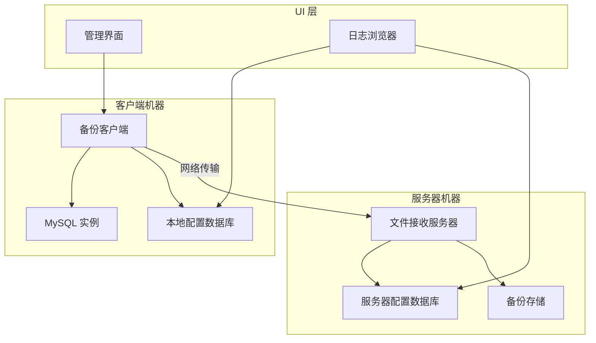

# 设计文档：MySQL 全文件备份工具

## 概述

MySQL 全文件备份工具是基于 .NET 构建的分布式备份解决方案，为 MySQL 数据库提供企业级备份功能。系统采用客户端-服务器架构，其中备份客户端管理 MySQL 实例并创建备份，而文件接收服务器处理存储和文件管理。该解决方案设计用于处理大型数据库（100GB+），具备断点续传、多线程和全面日志记录功能。

系统解决了企业环境中对可靠 MySQL 备份的关键需求，通过实施安全的备份流程来最小化停机时间并确保数据完整性。关键创新包括大型数据库的文件分块、中断传输的断点续传功能以及分布式部署的灵活性。

## 架构

### 系统架构

系统采用分布式客户端-服务器架构，包含以下关键组件：



### 部署模式

1. **单机部署**：客户端和服务器组件在同一台机器上
2. **分布式部署**：客户端和服务器在通过网络连接的不同机器上
3. **多客户端部署**：多个客户端备份到集中式服务器

### 通信协议

系统使用基于 TCP 的通信，包含以下协议层：
- **传输层**：带可配置端口的 TCP 套接字
- **消息层**：用于文件传输命令的自定义二进制协议
- **安全层**：传输中数据的 TLS 加密
- **断点续传层**：基于分块的传输和断点续传令牌

## 组件和接口

### 备份客户端组件

**主要职责：**
- MySQL 实例生命周期管理（停止/启动）
- 数据目录压缩
- 文件传输协调
- 本地配置管理
- 进度报告和日志记录

**关键接口：**

```csharp
public interface IMySQLManager
{
    Task<bool> StopInstanceAsync(string serviceName);
    Task<bool> StartInstanceAsync(string serviceName);
    Task<bool> VerifyInstanceAvailabilityAsync(ConnectionInfo connection);
}

public interface ICompressionService
{
    Task<string> CompressDirectoryAsync(string sourcePath, string targetPath, IProgress<CompressionProgress> progress);
    Task CleanupAsync(string filePath);
}

public interface IFileTransferClient
{
    Task<TransferResult> TransferFileAsync(string filePath, TransferConfig config, CancellationToken cancellationToken);
    Task<TransferResult> ResumeTransferAsync(string resumeToken, CancellationToken cancellationToken);
}
```

### 文件接收服务器组件

**主要职责：**
- 传入连接的网络监听器
- 文件分块接收和重组
- 备份文件组织和存储
- 断点续传令牌管理
- 并发客户端处理

**关键接口：**

```csharp
public interface IFileReceiver
{
    Task StartListeningAsync(int port);
    Task StopListeningAsync();
    Task<ReceiveResult> ReceiveFileAsync(ReceiveRequest request);
}

public interface IChunkManager
{
    Task<string> InitializeTransferAsync(FileMetadata metadata);
    Task<ChunkResult> ReceiveChunkAsync(string transferId, ChunkData chunk);
    Task<string> FinalizeTransferAsync(string transferId);
    Task<ResumeInfo> GetResumeInfoAsync(string resumeToken);
}

public interface IStorageManager
{
    Task<string> CreateBackupPathAsync(BackupMetadata metadata);
    Task<bool> ValidateStorageSpaceAsync(long requiredSpace);
    Task ApplyRetentionPolicyAsync(RetentionPolicy policy);
}
```

### 配置数据库组件

**架构设计：**

```sql
-- 配置表
CREATE TABLE BackupConfigurations (
    Id INTEGER PRIMARY KEY,
    Name TEXT NOT NULL,
    MySQLConnectionString TEXT NOT NULL,
    DataDirectoryPath TEXT NOT NULL,
    ServiceName TEXT NOT NULL,
    TargetServerIP TEXT NOT NULL,
    TargetServerPort INTEGER NOT NULL,
    TargetDirectory TEXT NOT NULL,
    NamingStrategy TEXT NOT NULL,
    IsActive BOOLEAN DEFAULT 1,
    CreatedAt DATETIME DEFAULT CURRENT_TIMESTAMP
);

CREATE TABLE ScheduleConfigurations (
    Id INTEGER PRIMARY KEY,
    BackupConfigId INTEGER REFERENCES BackupConfigurations(Id),
    ScheduleType TEXT NOT NULL, -- 'Daily', 'Weekly', 'Monthly'
    ScheduleTime TEXT NOT NULL,
    IsEnabled BOOLEAN DEFAULT 1
);

-- 日志表
CREATE TABLE BackupLogs (
    Id INTEGER PRIMARY KEY,
    BackupConfigId INTEGER REFERENCES BackupConfigurations(Id),
    StartTime DATETIME NOT NULL,
    EndTime DATETIME,
    Status TEXT NOT NULL, -- 'Running', 'Completed', 'Failed', 'Cancelled'
    FilePath TEXT,
    FileSize INTEGER,
    ErrorMessage TEXT,
    ResumeToken TEXT
);

CREATE TABLE TransferLogs (
    Id INTEGER PRIMARY KEY,
    BackupLogId INTEGER REFERENCES BackupLogs(Id),
    ChunkIndex INTEGER NOT NULL,
    ChunkSize INTEGER NOT NULL,
    TransferTime DATETIME NOT NULL,
    Status TEXT NOT NULL
);
```

### 用户界面组件

**管理界面功能：**
- 配置管理表单
- 实时备份进度显示
- 计划配置向导
- 系统状态仪表板

**日志浏览器功能：**
- 可搜索的备份历史
- 按日期、状态、配置过滤
- 详细传输进度视图
- 报告导出功能

## 数据模型

### 核心数据结构

```csharp
public class BackupConfiguration
{
    public int Id { get; set; }
    public string Name { get; set; }
    public MySQLConnectionInfo MySQLConnection { get; set; }
    public string DataDirectoryPath { get; set; }
    public string ServiceName { get; set; }
    public ServerEndpoint TargetServer { get; set; }
    public string TargetDirectory { get; set; }
    public FileNamingStrategy NamingStrategy { get; set; }
    public bool IsActive { get; set; }
    public DateTime CreatedAt { get; set; }
}

public class MySQLConnectionInfo
{
    public string Username { get; set; }
    public string Password { get; set; }
    public string ServiceName { get; set; }
    public string DataDirectoryPath { get; set; }
    public int Port { get; set; } = 3306;
    public string Host { get; set; } = "localhost";
}

public class ServerEndpoint
{
    public string IPAddress { get; set; }
    public int Port { get; set; }
    public bool UseSSL { get; set; } = true;
}

public class FileNamingStrategy
{
    public string Pattern { get; set; } // 例如："{timestamp}_{database}_{server}.zip"
    public string DateFormat { get; set; } = "yyyyMMdd_HHmmss";
    public bool IncludeServerName { get; set; } = true;
    public bool IncludeDatabaseName { get; set; } = true;
}
```

### 传输协议模型

```csharp
public class TransferRequest
{
    public string TransferId { get; set; }
    public FileMetadata Metadata { get; set; }
    public ChunkingStrategy ChunkingStrategy { get; set; }
    public bool ResumeTransfer { get; set; }
    public string ResumeToken { get; set; }
}

public class FileMetadata
{
    public string FileName { get; set; }
    public long FileSize { get; set; }
    public string ChecksumMD5 { get; set; }
    public string ChecksumSHA256 { get; set; }
    public DateTime CreatedAt { get; set; }
    public BackupConfiguration SourceConfig { get; set; }
}

public class ChunkingStrategy
{
    public long ChunkSize { get; set; } = 50 * 1024 * 1024; // 默认 50MB
    public int MaxConcurrentChunks { get; set; } = 4;
    public bool EnableCompression { get; set; } = true;
}

public class ChunkData
{
    public string TransferId { get; set; }
    public int ChunkIndex { get; set; }
    public byte[] Data { get; set; }
    public string ChunkChecksum { get; set; }
    public bool IsLastChunk { get; set; }
}
```

### 日志和进度模型

```csharp
public class BackupLog
{
    public int Id { get; set; }
    public int BackupConfigId { get; set; }
    public DateTime StartTime { get; set; }
    public DateTime? EndTime { get; set; }
    public BackupStatus Status { get; set; }
    public string FilePath { get; set; }
    public long? FileSize { get; set; }
    public string ErrorMessage { get; set; }
    public string ResumeToken { get; set; }
    public List<TransferLog> TransferLogs { get; set; }
}

public enum BackupStatus
{
    Queued,      // 排队中
    StoppingMySQL,  // 停止MySQL
    Compressing,    // 压缩中
    Transferring,   // 传输中
    StartingMySQL,  // 启动MySQL
    Verifying,      // 验证中
    Completed,      // 已完成
    Failed,         // 失败
    Cancelled       // 已取消
}

public class BackupProgress
{
    public BackupStatus CurrentStatus { get; set; }
    public double OverallProgress { get; set; } // 0.0 到 1.0
    public string CurrentOperation { get; set; }
    public long BytesTransferred { get; set; }
    public long TotalBytes { get; set; }
    public TimeSpan ElapsedTime { get; set; }
    public TimeSpan? EstimatedTimeRemaining { get; set; }
    public double TransferRate { get; set; } // 每秒字节数
}
```

## 错误处理

### 错误类别和恢复策略

**MySQL 管理错误：**
- **服务停止失败**：使用递增超时重试，持续失败时发出警报
- **服务启动失败**：尝试多种重启策略，手动干预警报
- **连接验证失败**：使用退避重试，持续失败时回滚

**文件系统错误：**
- **压缩失败**：清理部分文件，重启 MySQL，记录详细错误
- **磁盘空间不足**：警告管理员，实施清理策略
- **权限错误**：提供权限解决的明确指导

**网络传输错误：**
- **连接超时**：实施指数退避重试
- **传输中断**：生成断点续传令牌，排队重试
- **校验和不匹配**：重试分块传输，持续失败时升级

**配置错误：**
- **无效连接参数**：保存前验证，提供清晰错误消息
- **缺少目录**：尝试创建，权限不足时警报
- **端口冲突**：检测并建议替代端口

### 错误恢复机制

```csharp
public class ErrorRecoveryManager
{
    public async Task<RecoveryResult> HandleMySQLStopFailure(MySQLStopError error)
    {
        // 实施递增重试策略
        // 1. 标准停止命令
        // 2. 带超时的强制停止
        // 3. 进程终止
        // 4. 手动干预警报
    }
    
    public async Task<RecoveryResult> HandleTransferFailure(TransferError error)
    {
        // 生成断点续传令牌
        // 清理部分传输
        // 使用退避排队重试
        // 超过最大重试次数时警报
    }
    
    public async Task<RecoveryResult> HandleCompressionFailure(CompressionError error)
    {
        // 清理部分压缩文件
        // 确保 MySQL 重启
        // 记录详细错误信息
        // 警告管理员
    }
}
```

### 日志策略

**结构化日志级别：**
- **Debug**：故障排除的详细操作跟踪
- **Info**：正常操作里程碑和进度
- **Warning**：可恢复错误和重试尝试
- **Error**：需要关注的失败操作
- **Critical**：需要立即干预的系统故障

**日志关联：**
- 每个备份操作获得唯一的关联 ID
- 所有相关日志条目标记关联 ID
- 传输分块链接到父备份操作
- 错误日志包含完整上下文和堆栈跟踪

## 测试策略

测试策略采用双重方法，结合单元测试处理特定场景和基于属性的测试进行所有可能输入的全面验证。

**单元测试重点：**
- 配置验证边界情况
- MySQL 服务管理错误条件
- 文件系统权限场景
- 网络连接失败模式
- 断点续传令牌生成和验证
- 校验和计算准确性

**基于属性的测试重点：**
- 所有文件大小的文件传输完整性
- 任何分块策略的分块重组正确性
- 从任何中断点的断点续传能力
- 配置持久化和检索一致性
- 所有命名策略的备份命名唯一性

**集成测试：**
- 端到端备份工作流
- 多客户端并发操作
- 大文件处理（100GB+ 场景）
- 网络故障和恢复场景
- 跨平台兼容性验证

**性能测试：**
- 大文件操作期间的内存使用
- 网络吞吐量优化
- 并发客户端处理能力
- 负载下的数据库查询性能
- 后台操作期间的 UI 响应性

**属性测试配置：**
- 每个属性测试最少 100 次迭代
- 每个测试标记功能和属性引用
- 随机化测试数据生成以获得全面覆盖
- 可重现测试失败的确定性种子值

## 正确性属性

*属性是应该在系统的所有有效执行中保持为真的特征或行为——本质上是关于系统应该做什么的正式陈述。属性作为人类可读规范和机器可验证正确性保证之间的桥梁。*

基于预工作分析和属性反思以消除冗余，以下属性捕获了基本的正确性要求：

### 属性 1：配置往返一致性
*对于任何*有效的配置数据（MySQL 连接信息、备份目标或调度设置），存储配置然后检索它应该产生等效的配置数据。
**验证：需求 2.1、2.2、2.3**

### 属性 2：网络通信建立
*对于任何*具有网络连接的有效客户端-服务器端点对，备份客户端应该能够与文件接收服务器建立安全通信。
**验证：需求 1.2、1.5、8.1、8.2**

### 属性 3：并发客户端支持
*对于任何*多个备份客户端实例集合，文件接收服务器应该能够同时处理来自所有客户端的并发连接。
**验证：需求 1.4、8.5**

### 属性 4：配置验证
*对于任何*配置输入，系统应该接受有效配置并拒绝无效配置，确保只存储有效配置。
**验证：需求 2.4**

### 属性 5：MySQL 实例管理
*对于任何*处于运行状态的 MySQL 实例，备份过程应该能够停止实例、执行操作、重启实例并验证可用性，将实例返回到运行状态。
**验证：需求 3.1、3.4、3.5**

### 属性 6：文件压缩和传输
*对于任何*有效的数据目录，系统应该能够将其压缩为备份文件并按照配置的命名约定将其传输到目标位置。
**验证：需求 3.2、3.3**

### 属性 7：备份清理
*对于任何*成功的备份操作，系统应该在确认 MySQL 可用性后清理临时文件（本地 Data.zip）。
**验证：需求 3.6**

### 属性 8：大文件分块
*对于任何*超过配置大小阈值的备份文件，系统应该将其分割成分块并在目标位置正确重组，重组后的文件与原文件相同。
**验证：需求 4.1、4.2**

### 属性 9：文件完整性验证
*对于任何*文件传输（分块或整体），系统应该使用校验和验证文件完整性并检测任何损坏或修改。
**验证：需求 4.5、8.4**

### 属性 10：进度报告单调性
*对于任何*备份操作，进度指示器应该单调递增（永不减少）并在成功完成时达到 100%。
**验证：需求 4.4**

### 属性 11：断点续传能力
*对于任何*在任何点中断的备份传输，系统应该生成断点续传令牌并能够从最后成功传输的分块继续传输，最终结果与未中断传输相同。
**验证：需求 5.1、5.2、5.3、5.4**

### 属性 12：断点续传令牌清理
*对于任何*使用断点续传功能成功完成的备份操作，系统应该自动清理相关的断点续传令牌数据。
**验证：需求 5.5**

### 属性 13：后台进度更新
*对于任何*在后台运行的备份操作，系统应该向用户界面提供实时进度更新而不阻塞操作。
**验证：需求 6.3**

### 属性 14：优雅取消
*对于任何*正在运行的备份操作，系统应该能够优雅地取消操作，确保 MySQL 重启并清理临时文件。
**验证：需求 6.5**

### 属性 15：全面备份日志记录
*对于任何*备份操作（成功或失败），系统应该记录所有必需信息，包括开始时间、结束时间、文件大小、完成状态和任何错误详情。
**验证：需求 7.1、7.4**

### 属性 16：日志存储和检索
*对于任何*备份日志条目，存储日志然后搜索/检索它应该返回相同的日志数据，所有元数据完整。
**验证：需求 7.2**

### 属性 17：日志保留策略执行
*对于任何*配置的保留策略（基于年龄、数量或空间），系统应该根据策略自动删除旧日志，同时保留符合保留条件的日志。
**验证：需求 7.5**

### 属性 18：备份报告生成
*对于任何*时间段和备份操作集合，系统应该生成准确反映该时间段备份统计信息的摘要报告。
**验证：需求 7.6**

### 属性 19：网络传输重试与退避
*对于任何*网络传输失败，系统应该实施带指数退避的重试机制，在连接恢复时最终成功或在最大重试次数后失败。
**验证：需求 8.3、8.6**

### 属性 20：MySQL 重启的错误恢复
*对于任何*备份操作失败（压缩、传输等），系统应该确保 MySQL 实例重启并正确记录错误。
**验证：需求 3.7、9.1、9.2、9.3**

### 属性 21：关键错误警报
*对于任何*关键系统错误，系统应该通过所有配置的警报渠道发送通知。
**验证：需求 9.4、9.6**

### 属性 22：操作超时预防
*对于任何*系统操作，操作应该在配置的超时限制内完成或被终止以防止无限期挂起。
**验证：需求 9.5**

### 属性 23：文件命名唯一性和模式
*对于任何*使用任何命名策略配置的备份操作，系统应该生成遵循配置模式的唯一文件名并防止覆盖。
**验证：需求 10.1、10.2、10.3**

### 属性 24：目录组织
*对于任何*备份文件和目录结构配置，文件接收服务器应该根据配置的结构组织备份文件。
**验证：需求 10.4**

### 属性 25：文件保留策略应用
*对于任何*配置的文件保留策略，系统应该根据策略（年龄、数量或存储空间限制）自动管理备份文件。
**验证：需求 10.5**