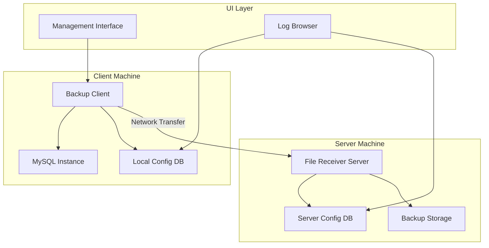

# Design Document: MySQL Full-File Backup Tool

## Overview

The MySQL Full-File Backup Tool is a distributed backup solution built on .NET that provides enterprise-grade backup capabilities for MySQL databases. The system employs a client-server architecture where the Backup Client manages MySQL instances and creates backups, while the File Receiver Server handles storage and file management. The solution is designed to handle large databases (100GB+) with resume capabilities, multi-threading, and comprehensive logging.

The system addresses the critical need for reliable MySQL backups in enterprise environments by implementing a safe backup process that minimizes downtime and ensures data integrity. Key innovations include file chunking for large databases, resume capability for interrupted transfers, and distributed deployment flexibility.

## Architecture

### System Architecture

The system follows a distributed client-server architecture with the following key components:



### Deployment Models

1. **Single Machine Deployment**: Both client and server components on the same machine
2. **Distributed Deployment**: Client and server on separate machines connected via network
3. **Multi-Client Deployment**: Multiple clients backing up to a centralized server

### Communication Protocol

The system uses TCP-based communication with the following protocol layers:
- **Transport Layer**: TCP sockets with configurable ports
- **Message Layer**: Custom binary protocol for file transfer commands
- **Security Layer**: TLS encryption for data in transit
- **Resume Layer**: Chunk-based transfer with resume tokens

## Components and Interfaces

### Backup Client Component

**Primary Responsibilities:**
- MySQL instance lifecycle management (stop/start)
- Data directory compression
- File transfer coordination
- Local configuration management
- Progress reporting and logging

**Key Interfaces:**

```csharp
public interface IMySQLManager
{
    Task<bool> StopInstanceAsync(string serviceName);
    Task<bool> StartInstanceAsync(string serviceName);
    Task<bool> VerifyInstanceAvailabilityAsync(ConnectionInfo connection);
}

public interface ICompressionService
{
    Task<string> CompressDirectoryAsync(string sourcePath, string targetPath, IProgress<CompressionProgress> progress);
    Task CleanupAsync(string filePath);
}

public interface IFileTransferClient
{
    Task<TransferResult> TransferFileAsync(string filePath, TransferConfig config, CancellationToken cancellationToken);
    Task<TransferResult> ResumeTransferAsync(string resumeToken, CancellationToken cancellationToken);
}
```

### File Receiver Server Component

**Primary Responsibilities:**
- Network listener for incoming connections
- File chunk reception and reassembly
- Backup file organization and storage
- Resume token management
- Concurrent client handling

**Key Interfaces:**

```csharp
public interface IFileReceiver
{
    Task StartListeningAsync(int port);
    Task StopListeningAsync();
    Task<ReceiveResult> ReceiveFileAsync(ReceiveRequest request);
}

public interface IChunkManager
{
    Task<string> InitializeTransferAsync(FileMetadata metadata);
    Task<ChunkResult> ReceiveChunkAsync(string transferId, ChunkData chunk);
    Task<string> FinalizeTransferAsync(string transferId);
    Task<ResumeInfo> GetResumeInfoAsync(string resumeToken);
}

public interface IStorageManager
{
    Task<string> CreateBackupPathAsync(BackupMetadata metadata);
    Task<bool> ValidateStorageSpaceAsync(long requiredSpace);
    Task ApplyRetentionPolicyAsync(RetentionPolicy policy);
}
```

### Configuration Database Component

**Schema Design:**

```sql
-- Configuration Tables
CREATE TABLE BackupConfigurations (
    Id INTEGER PRIMARY KEY,
    Name TEXT NOT NULL,
    MySQLConnectionString TEXT NOT NULL,
    DataDirectoryPath TEXT NOT NULL,
    ServiceName TEXT NOT NULL,
    TargetServerIP TEXT NOT NULL,
    TargetServerPort INTEGER NOT NULL,
    TargetDirectory TEXT NOT NULL,
    NamingStrategy TEXT NOT NULL,
    IsActive BOOLEAN DEFAULT 1,
    CreatedAt DATETIME DEFAULT CURRENT_TIMESTAMP
);

CREATE TABLE ScheduleConfigurations (
    Id INTEGER PRIMARY KEY,
    BackupConfigId INTEGER REFERENCES BackupConfigurations(Id),
    ScheduleType TEXT NOT NULL, -- 'Daily', 'Weekly', 'Monthly'
    ScheduleTime TEXT NOT NULL,
    IsEnabled BOOLEAN DEFAULT 1
);

-- Logging Tables
CREATE TABLE BackupLogs (
    Id INTEGER PRIMARY KEY,
    BackupConfigId INTEGER REFERENCES BackupConfigurations(Id),
    StartTime DATETIME NOT NULL,
    EndTime DATETIME,
    Status TEXT NOT NULL, -- 'Running', 'Completed', 'Failed', 'Cancelled'
    FilePath TEXT,
    FileSize INTEGER,
    ErrorMessage TEXT,
    ResumeToken TEXT
);

CREATE TABLE TransferLogs (
    Id INTEGER PRIMARY KEY,
    BackupLogId INTEGER REFERENCES BackupLogs(Id),
    ChunkIndex INTEGER NOT NULL,
    ChunkSize INTEGER NOT NULL,
    TransferTime DATETIME NOT NULL,
    Status TEXT NOT NULL
);
```

### User Interface Component

**Management Interface Features:**
- Configuration management forms
- Real-time backup progress display
- Schedule configuration wizard
- System status dashboard

**Log Browser Features:**
- Searchable backup history
- Filtering by date, status, configuration
- Detailed transfer progress views
- Export capabilities for reporting

## Data Models

### Core Data Structures

```csharp
public class BackupConfiguration
{
    public int Id { get; set; }
    public string Name { get; set; }
    public MySQLConnectionInfo MySQLConnection { get; set; }
    public string DataDirectoryPath { get; set; }
    public string ServiceName { get; set; }
    public ServerEndpoint TargetServer { get; set; }
    public string TargetDirectory { get; set; }
    public FileNamingStrategy NamingStrategy { get; set; }
    public bool IsActive { get; set; }
    public DateTime CreatedAt { get; set; }
}

public class MySQLConnectionInfo
{
    public string Username { get; set; }
    public string Password { get; set; }
    public string ServiceName { get; set; }
    public string DataDirectoryPath { get; set; }
    public int Port { get; set; } = 3306;
    public string Host { get; set; } = "localhost";
}

public class ServerEndpoint
{
    public string IPAddress { get; set; }
    public int Port { get; set; }
    public bool UseSSL { get; set; } = true;
}

public class FileNamingStrategy
{
    public string Pattern { get; set; } // e.g., "{timestamp}_{database}_{server}.zip"
    public string DateFormat { get; set; } = "yyyyMMdd_HHmmss";
    public bool IncludeServerName { get; set; } = true;
    public bool IncludeDatabaseName { get; set; } = true;
}
```

### Transfer Protocol Models

```csharp
public class TransferRequest
{
    public string TransferId { get; set; }
    public FileMetadata Metadata { get; set; }
    public ChunkingStrategy ChunkingStrategy { get; set; }
    public bool ResumeTransfer { get; set; }
    public string ResumeToken { get; set; }
}

public class FileMetadata
{
    public string FileName { get; set; }
    public long FileSize { get; set; }
    public string ChecksumMD5 { get; set; }
    public string ChecksumSHA256 { get; set; }
    public DateTime CreatedAt { get; set; }
    public BackupConfiguration SourceConfig { get; set; }
}

public class ChunkingStrategy
{
    public long ChunkSize { get; set; } = 50 * 1024 * 1024; // 50MB default
    public int MaxConcurrentChunks { get; set; } = 4;
    public bool EnableCompression { get; set; } = true;
}

public class ChunkData
{
    public string TransferId { get; set; }
    public int ChunkIndex { get; set; }
    public byte[] Data { get; set; }
    public string ChunkChecksum { get; set; }
    public bool IsLastChunk { get; set; }
}
```

### Logging and Progress Models

```csharp
public class BackupLog
{
    public int Id { get; set; }
    public int BackupConfigId { get; set; }
    public DateTime StartTime { get; set; }
    public DateTime? EndTime { get; set; }
    public BackupStatus Status { get; set; }
    public string FilePath { get; set; }
    public long? FileSize { get; set; }
    public string ErrorMessage { get; set; }
    public string ResumeToken { get; set; }
    public List<TransferLog> TransferLogs { get; set; }
}

public enum BackupStatus
{
    Queued,
    StoppingMySQL,
    Compressing,
    Transferring,
    StartingMySQL,
    Verifying,
    Completed,
    Failed,
    Cancelled
}

public class BackupProgress
{
    public BackupStatus CurrentStatus { get; set; }
    public double OverallProgress { get; set; } // 0.0 to 1.0
    public string CurrentOperation { get; set; }
    public long BytesTransferred { get; set; }
    public long TotalBytes { get; set; }
    public TimeSpan ElapsedTime { get; set; }
    public TimeSpan? EstimatedTimeRemaining { get; set; }
    public double TransferRate { get; set; } // bytes per second
}
```

## Error Handling

### Error Categories and Recovery Strategies

**MySQL Management Errors:**
- **Service Stop Failure**: Retry with escalating timeouts, alert if persistent
- **Service Start Failure**: Attempt multiple restart strategies, manual intervention alert
- **Connection Verification Failure**: Retry with backoff, rollback if persistent

**File System Errors:**
- **Compression Failure**: Clean up partial files, restart MySQL, log detailed error
- **Disk Space Exhaustion**: Alert administrators, implement cleanup policies
- **Permission Errors**: Provide clear guidance for permission resolution

**Network Transfer Errors:**
- **Connection Timeout**: Implement exponential backoff retry
- **Transfer Interruption**: Generate resume token, queue for retry
- **Checksum Mismatch**: Retry chunk transfer, escalate if persistent

**Configuration Errors:**
- **Invalid Connection Parameters**: Validate before saving, provide clear error messages
- **Missing Directories**: Attempt to create, alert if permissions insufficient
- **Port Conflicts**: Detect and suggest alternative ports

### Error Recovery Mechanisms

```csharp
public class ErrorRecoveryManager
{
    public async Task<RecoveryResult> HandleMySQLStopFailure(MySQLStopError error)
    {
        // Implement escalating retry strategy
        // 1. Standard stop command
        // 2. Force stop with timeout
        // 3. Process termination
        // 4. Manual intervention alert
    }
    
    public async Task<RecoveryResult> HandleTransferFailure(TransferError error)
    {
        // Generate resume token
        // Clean up partial transfers
        // Queue for retry with backoff
        // Alert if max retries exceeded
    }
    
    public async Task<RecoveryResult> HandleCompressionFailure(CompressionError error)
    {
        // Clean up partial compression files
        // Ensure MySQL is restarted
        // Log detailed error information
        // Alert administrators
    }
}
```

### Logging Strategy

**Structured Logging Levels:**
- **Debug**: Detailed operation traces for troubleshooting
- **Info**: Normal operation milestones and progress
- **Warning**: Recoverable errors and retry attempts
- **Error**: Failed operations requiring attention
- **Critical**: System failures requiring immediate intervention

**Log Correlation:**
- Each backup operation gets a unique correlation ID
- All related log entries tagged with correlation ID
- Transfer chunks linked to parent backup operation
- Error logs include full context and stack traces

## Testing Strategy

The testing strategy employs a dual approach combining unit tests for specific scenarios and property-based tests for comprehensive validation across all possible inputs.

**Unit Testing Focus:**
- Configuration validation edge cases
- MySQL service management error conditions
- File system permission scenarios
- Network connectivity failure modes
- Resume token generation and validation
- Checksum calculation accuracy

**Property-Based Testing Focus:**
- File transfer integrity across all file sizes
- Chunk reassembly correctness for any chunking strategy
- Resume capability from any interruption point
- Configuration persistence and retrieval consistency
- Backup naming uniqueness across all naming strategies

**Integration Testing:**
- End-to-end backup workflows
- Multi-client concurrent operations
- Large file handling (100GB+ scenarios)
- Network failure and recovery scenarios
- Cross-platform compatibility validation

**Performance Testing:**
- Memory usage during large file operations
- Network throughput optimization
- Concurrent client handling capacity
- Database query performance under load
- UI responsiveness during background operations

**Property Test Configuration:**
- Minimum 100 iterations per property test
- Each test tagged with feature and property reference
- Randomized test data generation for comprehensive coverage
- Deterministic seed values for reproducible test failures

## Correctness Properties

*A property is a characteristic or behavior that should hold true across all valid executions of a system—essentially, a formal statement about what the system should do. Properties serve as the bridge between human-readable specifications and machine-verifiable correctness guarantees.*

Based on the prework analysis and property reflection to eliminate redundancy, the following properties capture the essential correctness requirements:

### Property 1: Configuration Round-Trip Consistency
*For any* valid configuration data (MySQL connection info, backup targets, or scheduling settings), storing the configuration and then retrieving it should produce equivalent configuration data.
**Validates: Requirements 2.1, 2.2, 2.3**

### Property 2: Network Communication Establishment
*For any* valid client-server endpoint pair with network connectivity, the Backup Client should be able to establish secure communication with the File Receiver Server.
**Validates: Requirements 1.2, 1.5, 8.1, 8.2**

### Property 3: Concurrent Client Support
*For any* set of multiple Backup Client instances, the File Receiver Server should be able to handle concurrent connections from all clients simultaneously.
**Validates: Requirements 1.4, 8.5**

### Property 4: Configuration Validation
*For any* configuration input, the system should accept valid configurations and reject invalid configurations, ensuring only valid configurations are stored.
**Validates: Requirements 2.4**

### Property 5: MySQL Instance Management
*For any* MySQL instance in a running state, the backup process should be able to stop the instance, perform operations, restart the instance, and verify availability, returning the instance to a running state.
**Validates: Requirements 3.1, 3.4, 3.5**

### Property 6: File Compression and Transfer
*For any* valid data directory, the system should be able to compress it into a backup file and transfer it to the target location following the configured naming convention.
**Validates: Requirements 3.2, 3.3**

### Property 7: Backup Cleanup
*For any* successful backup operation, the system should clean up temporary files (local Data.zip) after confirming MySQL availability.
**Validates: Requirements 3.6**

### Property 8: File Chunking for Large Files
*For any* backup file exceeding the configured size threshold, the system should split it into chunks and reassemble them correctly at the destination, with the reassembled file being identical to the original.
**Validates: Requirements 4.1, 4.2**

### Property 9: File Integrity Validation
*For any* file transfer (chunked or whole), the system should validate file integrity using checksums and detect any corruption or modification.
**Validates: Requirements 4.5, 8.4**

### Property 10: Progress Reporting Monotonicity
*For any* backup operation, progress indicators should be monotonically increasing (never decrease) and reach 100% upon successful completion.
**Validates: Requirements 4.4**

### Property 11: Resume Capability
*For any* backup transfer interrupted at any point, the system should generate a resume token and be able to continue the transfer from the last successfully transferred chunk, with the final result being identical to an uninterrupted transfer.
**Validates: Requirements 5.1, 5.2, 5.3, 5.4**

### Property 12: Resume Token Cleanup
*For any* successfully completed backup operation that used resume functionality, the system should automatically clean up the associated resume token data.
**Validates: Requirements 5.5**

### Property 13: Background Progress Updates
*For any* backup operation running in the background, the system should provide real-time progress updates to the user interface without blocking the operation.
**Validates: Requirements 6.3**

### Property 14: Graceful Cancellation
*For any* running backup operation, the system should be able to cancel the operation gracefully, ensuring MySQL is restarted and temporary files are cleaned up.
**Validates: Requirements 6.5**

### Property 15: Comprehensive Backup Logging
*For any* backup operation (successful or failed), the system should log all required information including start time, end time, file sizes, completion status, and any error details.
**Validates: Requirements 7.1, 7.4**

### Property 16: Log Storage and Retrieval
*For any* backup log entry, storing the log and then searching/retrieving it should return the same log data with all metadata intact.
**Validates: Requirements 7.2**

### Property 17: Log Retention Policy Enforcement
*For any* configured retention policy (age, count, or space-based), the system should automatically remove old logs according to the policy while preserving logs that meet the retention criteria.
**Validates: Requirements 7.5**

### Property 18: Backup Report Generation
*For any* time period and set of backup operations, the system should generate summary reports that accurately reflect the backup statistics for that period.
**Validates: Requirements 7.6**

### Property 19: Network Transfer Retry with Backoff
*For any* network transfer failure, the system should implement retry mechanisms with exponential backoff, eventually succeeding when connectivity is restored or failing after maximum retries.
**Validates: Requirements 8.3, 8.6**

### Property 20: Error Recovery with MySQL Restart
*For any* backup operation failure (compression, transfer, etc.), the system should ensure the MySQL instance is restarted and the error is properly logged.
**Validates: Requirements 3.7, 9.1, 9.2, 9.3**

### Property 21: Critical Error Alerting
*For any* critical system error, the system should send notifications through all configured alert channels.
**Validates: Requirements 9.4, 9.6**

### Property 22: Operation Timeout Prevention
*For any* system operation, the operation should complete within configured timeout limits or be terminated to prevent indefinite hanging.
**Validates: Requirements 9.5**

### Property 23: File Naming Uniqueness and Patterns
*For any* backup operation with any naming strategy configuration, the system should generate unique filenames that follow the configured pattern and prevent overwrites.
**Validates: Requirements 10.1, 10.2, 10.3**

### Property 24: Directory Organization
*For any* backup file and directory structure configuration, the File Receiver Server should organize backup files according to the configured structure.
**Validates: Requirements 10.4**

### Property 25: File Retention Policy Application
*For any* configured file retention policy, the system should automatically manage backup files according to the policy (age, count, or storage space limits).
**Validates: Requirements 10.5**