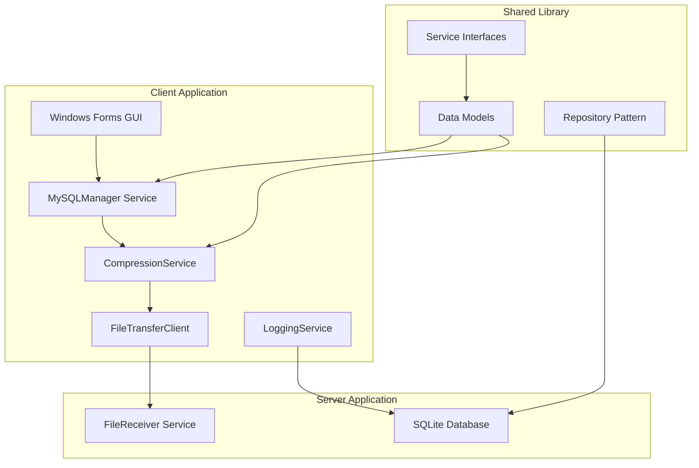
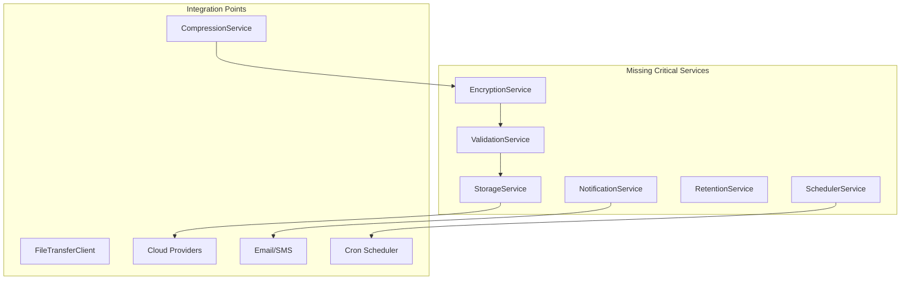

# Design Document: MySQL Backup Tool - Updated Architecture

## Overview

The MySQL Full-File Backup Tool is a distributed backup solution built on .NET that provides enterprise-grade backup capabilities for MySQL databases. The system employs a client-server architecture where the Backup Client manages MySQL instances and creates backups, while the File Receiver Server handles storage and file management.

**Current Implementation Status**: The system has substantial working functionality but requires interface alignment and implementation of missing critical services to achieve full specification compliance.

## Current Architecture Analysis

### Implemented Components

The system currently has these working components:



### Missing Components (To Be Implemented)



## Service Architecture

### Current Service Implementations

#### 1. MySQLManager Service
**Location**: `src/MySqlBackupTool.Shared/Services/MySQLManager.cs`
**Status**: ✅ Implemented
**Capabilities**:
- MySQL service lifecycle management
- Database backup execution
- Connection verification
- Progress reporting
- Error handling and recovery

**Interface Needed**: `IBackupService` (for test compatibility)

#### 2. CompressionService
**Location**: `src/MySqlBackupTool.Shared/Services/CompressionService.cs`
**Status**: ✅ Implemented
**Capabilities**:
- GZip compression
- Async file processing
- Progress reporting
- Memory-efficient streaming

**Interface Needed**: `ICompressionService` (already exists)

#### 3. FileTransferClient
**Location**: `src/MySqlBackupTool.Shared/Services/FileTransferClient.cs`
**Status**: ✅ Implemented
**Capabilities**:
- TCP-based file transfer
- Progress tracking
- Connection management
- Error handling and retry

**Interface Needed**: `IFileTransferService` (for consistency)

#### 4. LoggingService
**Location**: `src/MySqlBackupTool.Shared/Services/LoggingService.cs`
**Status**: ✅ Implemented
**Capabilities**:
- Structured logging with Serilog
- Multiple output targets
- Configurable log levels
- Performance monitoring

**Interface Needed**: `ILoggingService` (for dependency injection)

### Missing Service Specifications

#### 1. EncryptionService (Critical)
**Interface**: `IEncryptionService`
**Requirements**:
```csharp
public interface IEncryptionService
{
    Task EncryptAsync(string inputPath, string outputPath, string password, CancellationToken cancellationToken = default);
    Task DecryptAsync(string inputPath, string outputPath, string password, CancellationToken cancellationToken = default);
    bool ValidatePassword(string encryptedFilePath, string password);
    Task<EncryptionMetadata> GetMetadataAsync(string encryptedFilePath);
}
```

**Implementation Requirements**:
- AES-256 encryption
- PBKDF2 key derivation
- Streaming for large files
- Progress reporting
- Secure memory handling

#### 2. ValidationService (Critical)
**Interface**: `IValidationService`
**Requirements**:
```csharp
public interface IValidationService
{
    Task<ValidationResult> ValidateBackupAsync(string filePath, CancellationToken cancellationToken = default);
    Task<bool> ValidateIntegrityAsync(string filePath, string expectedChecksum);
    Task<string> CalculateChecksumAsync(string filePath, ChecksumAlgorithm algorithm = ChecksumAlgorithm.SHA256);
    Task<ValidationReport> GenerateReportAsync(string filePath);
}
```

**Implementation Requirements**:
- File integrity validation
- Checksum calculation (MD5, SHA256)
- Corruption detection
- Detailed reporting
- Performance optimization

#### 3. StorageService (Medium Priority)
**Interface**: `IStorageService`
**Requirements**:
```csharp
public interface IStorageService
{
    Task<UploadResult> UploadAsync(string filePath, StorageProvider provider, StorageConfig config, CancellationToken cancellationToken = default);
    Task<DownloadResult> DownloadAsync(string remoteKey, string localPath, StorageProvider provider, StorageConfig config);
    Task<bool> ExistsAsync(string remoteKey, StorageProvider provider, StorageConfig config);
    Task<StorageInfo> GetInfoAsync(string remoteKey, StorageProvider provider, StorageConfig config);
}
```

**Supported Providers**:
- AWS S3
- Azure Blob Storage
- Google Cloud Storage
- Local file system

#### 4. NotificationService (Medium Priority)
**Interface**: `INotificationService`
**Requirements**:
```csharp
public interface INotificationService
{
    Task SendAsync(NotificationMessage message, NotificationChannel channel, CancellationToken cancellationToken = default);
    Task SendBulkAsync(IEnumerable<NotificationMessage> messages, NotificationChannel channel);
    Task<NotificationStatus> GetStatusAsync(string notificationId);
    Task<IEnumerable<NotificationTemplate>> GetTemplatesAsync();
}
```

**Supported Channels**:
- Email (SMTP)
- Webhooks
- SMS (optional)
- Slack integration (optional)

#### 5. RetentionService (Medium Priority)
**Interface**: `IRetentionService`
**Requirements**:
```csharp
public interface IRetentionService
{
    Task ApplyPolicyAsync(RetentionPolicy policy, string backupDirectory, CancellationToken cancellationToken = default);
    Task<RetentionReport> AnalyzeAsync(string backupDirectory, RetentionPolicy policy);
    Task<IEnumerable<string>> GetExpiredFilesAsync(string backupDirectory, RetentionPolicy policy);
    Task CleanupAsync(IEnumerable<string> filesToDelete, bool dryRun = false);
}
```

**Policy Types**:
- Age-based retention
- Count-based retention
- Size-based retention
- Custom retention rules

#### 6. SchedulerService (Low Priority)
**Interface**: `ISchedulerService`
**Requirements**:
```csharp
public interface ISchedulerService
{
    Task ScheduleAsync(BackupSchedule schedule, CancellationToken cancellationToken = default);
    Task UnscheduleAsync(string scheduleId);
    Task<IEnumerable<BackupSchedule>> GetSchedulesAsync();
    Task<ScheduleStatus> GetStatusAsync(string scheduleId);
    Task ExecuteNowAsync(string scheduleId);
}
```

**Features**:
- Cron expression support
- Recurring schedules
- One-time schedules
- Schedule monitoring
- Execution history

## Data Models

### Current Models (Implemented)
Located in `src/MySqlBackupTool.Shared/Models/`:
- `BackupConfiguration.cs`
- `MySQLConnectionInfo.cs`
- `ServerEndpoint.cs`
- `FileNamingStrategy.cs`
- `BackupOperationModels.cs`
- `TransferModels.cs`
- `LoggingModels.cs`

### Missing Models (To Be Implemented)

#### Encryption Models
```csharp
public class EncryptionMetadata
{
    public string Algorithm { get; set; } = "AES-256";
    public string KeyDerivation { get; set; } = "PBKDF2";
    public int Iterations { get; set; } = 100000;
    public byte[] Salt { get; set; }
    public byte[] IV { get; set; }
    public DateTime EncryptedAt { get; set; }
    public long OriginalSize { get; set; }
    public string OriginalChecksum { get; set; }
}

public class EncryptionConfig
{
    public string Password { get; set; }
    public int KeySize { get; set; } = 256;
    public int Iterations { get; set; } = 100000;
    public bool SecureDelete { get; set; } = true;
}
```

#### Validation Models
```csharp
public class ValidationResult
{
    public bool IsValid { get; set; }
    public string FilePath { get; set; }
    public long FileSize { get; set; }
    public string Checksum { get; set; }
    public ChecksumAlgorithm Algorithm { get; set; }
    public DateTime ValidatedAt { get; set; }
    public List<ValidationIssue> Issues { get; set; } = new();
    public TimeSpan ValidationDuration { get; set; }
}

public class ValidationIssue
{
    public ValidationIssueType Type { get; set; }
    public string Description { get; set; }
    public ValidationSeverity Severity { get; set; }
}
```

#### Storage Models
```csharp
public class StorageConfig
{
    public StorageProvider Provider { get; set; }
    public string ConnectionString { get; set; }
    public string BucketName { get; set; }
    public string Region { get; set; }
    public Dictionary<string, string> AdditionalSettings { get; set; } = new();
}

public class UploadResult
{
    public bool Success { get; set; }
    public string RemoteKey { get; set; }
    public long BytesUploaded { get; set; }
    public TimeSpan Duration { get; set; }
    public string ErrorMessage { get; set; }
}
```

## Integration Workflow

### Current Workflow (Implemented)
1. **Configuration** → Load backup settings from SQLite database
2. **MySQL Management** → Stop MySQL service safely
3. **Compression** → Compress data directory to ZIP file
4. **Transfer** → Send compressed file to server via TCP
5. **Logging** → Record operation details and progress
6. **Cleanup** → Remove temporary files and restart MySQL

### Target Workflow (With Missing Services)
1. **Configuration** → Load backup settings
2. **MySQL Management** → Stop MySQL service safely
3. **Compression** → Compress data directory
4. **Encryption** → Encrypt compressed file (NEW)
5. **Validation** → Verify file integrity (NEW)
6. **Transfer** → Send to local server
7. **Cloud Storage** → Upload to cloud providers (NEW)
8. **Notification** → Send status alerts (NEW)
9. **Retention** → Apply cleanup policies (NEW)
10. **Logging** → Record comprehensive details
11. **Cleanup** → Remove temporary files and restart MySQL

## Testing Strategy

### Current Test Issues
- Tests expect service names that don't match implementations
- Missing interfaces prevent proper dependency injection testing
- Integration tests don't exist for client-server communication

### Updated Testing Approach

#### Unit Testing
- Test each service independently using interfaces
- Mock dependencies for isolated testing
- Focus on edge cases and error conditions
- Validate all public methods and properties

#### Integration Testing
- Test complete workflows end-to-end
- Verify client-server communication
- Test with real databases and file systems
- Validate error recovery scenarios

#### Property-Based Testing
- Test universal properties across all inputs
- Validate data integrity throughout workflows
- Test encryption/decryption round-trips
- Verify backup restoration capabilities

## Performance Considerations

### Current Performance Characteristics
- **Memory Usage**: Efficient streaming for large files
- **Network Transfer**: TCP-based with progress reporting
- **Compression**: GZip with configurable levels
- **Database Operations**: SQLite with Entity Framework

### Performance Targets
- **Large Files**: Handle 100GB+ databases efficiently
- **Memory Usage**: < 500MB during operations
- **Network Throughput**: Utilize available bandwidth effectively
- **Compression Ratio**: Achieve 60-80% size reduction
- **Encryption Overhead**: < 10% performance impact

## Security Architecture

### Current Security Features
- SQLite database for configuration storage
- TCP-based network communication
- Basic error handling and logging

### Enhanced Security (To Be Implemented)
- **Encryption**: AES-256 for backup files
- **Network Security**: TLS for all communications
- **Authentication**: Client-server authentication
- **Credential Management**: Secure storage of passwords
- **Audit Logging**: Comprehensive security event logging

## Deployment Architecture

### Current Deployment
- **Client**: Windows Forms application
- **Server**: Console application with TCP listener
- **Database**: SQLite files for configuration and logs
- **Storage**: Local file system

### Enhanced Deployment Options
- **Client**: Windows service or GUI application
- **Server**: Windows service with multiple listeners
- **Database**: SQLite with backup and replication
- **Storage**: Local + cloud storage options
- **Monitoring**: Health checks and metrics collection

This updated design document reflects the current implementation state and provides a clear roadmap for completing the missing functionality while maintaining the existing architecture's strengths.